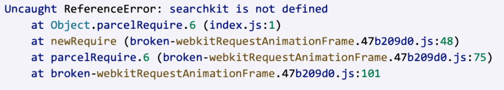

*Question 1*  

 
From: marissa@startup.com  
Subject:  Bad design  

Hello,  
  
Sorry to give you the kind of feedback that I know you do not want to hear, but I really hate the new dashboard design. Clearing and deleting indexes are now several clicks away. I am needing to use these features while iterating, so this is inconvenient.  
   
Thanks,  
Marissa  

REPLY: 

Hello Marrissa,

Thank you for reaching out with your feedback on the new dashboard design. We really appreciate hearing directly from our customers, as it's the best way to make improvements. I'm sorry to hear the changes have caused an inconvenience and affected your workflow, I understand quick and easy access to features is important to your iterative work.

Our design team is always working to enhance user experience and I've already passed your feedback along to them. We will certainly take your feedback in to consideration as we make future improvements. In the meantime, if you have any further suggestions or concerns, please don't hesitate to reach out to us.

Thank you,

Abdul 

  
--

*Question 2*:   
  
From: carrie@coffee.com  
Subject: URGENT ISSUE WITH PRODUCTION!!!!  
  
Since today 9:15am we have been seeing a lot of errors on our website. Multiple users have reported that they were unable to publish their feedbacks and that an alert box with "Record is too big, please contact enterprise@algolia.com".  
  
Our website is an imdb like website where users can post reviews of coffee shops online. Along with that we enrich every record with a lot of metadata that is not for search. I am already a paying customer of your service, what else do you need to make your search work?  
  
Please advise on how to fix this. Thanks.   

REPLY:

Hello Carrie,

Thank you for contacting us about your issue, I apologies for the inconvenience caused.

Upon investigation it seems like this error is being thrown because your websites submitted records are exceeding the set limit. We limit the size of individual records for performance reasons, if you signed up for your plan online the maximum record sizes are as follows:

	-For Build plans: 10KB for any individual record
	-For Standard, Premium and Growth plans: 100 KB for any individual record, and 10 KB average record size across all records
	-For legacy plans (before July 1, 2020): 10 KB for Pro, Starter, or Free accounts, and 20 KB for Essential and Plus
	-Business and Enterprise accounts have a 100 KB customizable limit. Contact the support team for more information.

If you would like to increase your accounts record size limit, then I can help you with that. In the meantime, you can reduce record size by removing any unnecessary metadata and leaving only the most important. If you think this isn't the issue, please provide me more information about the kind of records throwing the error and I will continue investigating.

Thank you,

Abdul 

  
--

*Question 3*:   

From: marc@hotmail.com  
Subject: Error on website  
  
Hi, my website is not working and here's the error:  
  
  
  
Can you fix it please?  

REPLY:

Hello Marc,

Thank you for contacting us about your issue, I apologies for the inconvenience caused. 

I will start investigating immediately and keep you updated with any findings. In the meantime, could you please provide more information about the error? Specifically, can you tell me what changes were made to the website that caused the error to occur? Any additional error messages or screenshots you can provide could be helpful in identifying the root issue.

Thank you,

Abdul 

